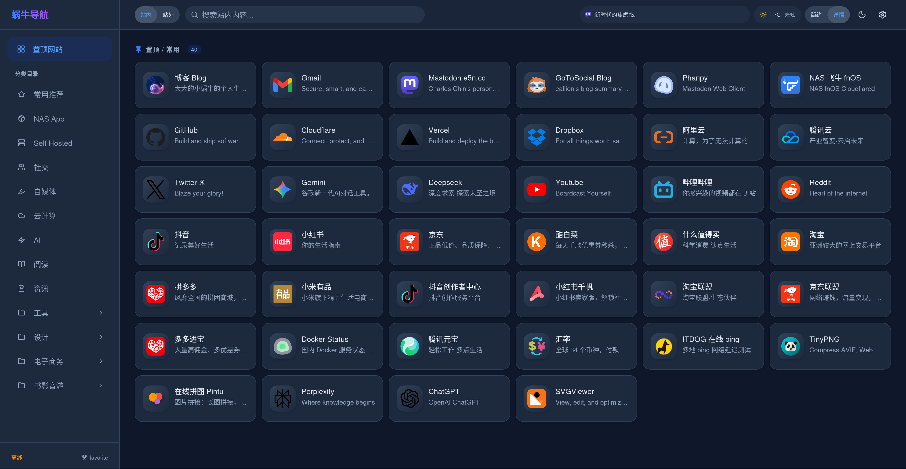

# 蜗牛个人导航 - 腾讯云 EdgeOne Pages 版

> 本项目完全由 AI 生成，我对项目中的代码一无所知。您可自由修改演绎。

**蜗牛个人导航**是一个基于 **React** + **Tailwind CSS** 构建的现代化云端导航/书签管理页面，专为 **Tencent Cloud EdgeOne Pages** 设计。它利用 EdgeOne Pages Functions 和 KV 存储，提供了一个无需维护服务器的 Serverless 导航解决方案。

## ✨ 特性

- **Serverless 架构**：完全运行在边缘节点，无需服务器。
- **KV 数据存储**：配置、分类和链接数据均存储在 EdgeOne KV 中，读写速度快。
- **安全管理**：
    - 后台管理通过 `PASSWORD` 环境变量保护。
    - 动态 Token 鉴权，支持自定义过期时间。
- **丰富的小组件**：
    - **实时天气**：集成和风天气 API。
    - **Mastodon 动态**：展示你的最新嘟文。
    - **AI**：集成 Gemini 等 AI 能力。
- **数据管理**：
    - 支持 Chrome/Edge 书签文件（Netscape HTML）导入/导出。
    - 支持 JSON 格式全量备份/恢复。
    - 完美的分类层级支持（递归导入导出）。
- **个性化**：
    - 支持深色/浅色模式切换。
    - 支持多种视图模式（列表/卡片）。
    - 自定义网站标题、Logo (Favicon)。

## 🚀 部署指南

本项目的部署依赖于 **腾讯云 EdgeOne Pages**。

### 前置要求

1.  腾讯云账号并开通 EdgeOne 服务。
2.  新建一个 `KV`，`命名空间名称` 随意，但绑定的变量名称必须为`CLOUDNAV_KV`（或修改代码适配名称）。

### 部署

1. 新建项目
2. 导入 Git 仓库

#### 构建设置

- 框架预设：`Vite`
- 根目录：`./`
- 输出目录：`./dist`
- 编译命令：`npm run build`
- 安装命令：`npm install`

#### 环境变量

- `PASSWORD`：前端登录密码。

### 绑定 KV

1. 点击左侧 `KV 存储`
2. 绑定命名空间

- 变量名称：`CLOUDNAV_KV`（如果没有修改代码，此处必须为`CLOUDNAV_KV`）
- 命名空间：选择前置要求中新建的命名空间

3. 重新部署

## ⚙️ 使用说明

1.  **首次访问**：点击页面右上角（或菜单中）的设置图标。
2.  **登录**：输入在环境变量中设置的 `PASSWORD`。
3.  **导入书签**：支持从浏览器导出的 `.html` 文件导入，系统会自动解析目录结构。
4.  **配置组件**：在设置面板中，你可以配置天气 API Key、Mastodon 实例地址等。

## 🚀 更新说明
**修复问题**：web页面没有ai配置

## 💡 灵感来源

本项目的灵感来源于以下优秀的开源项目，特此致谢：

- [sese972010/CloudNav-](https://github.com/sese972010/CloudNav-)
- [aabacada/CloudNav-abcd](https://github.com/aabacada/CloudNav-abcd)

## 📄 License

本项目采用 [GLWT License](LICENSE) 开源。
